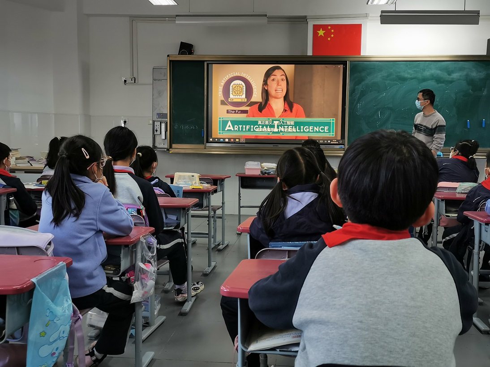
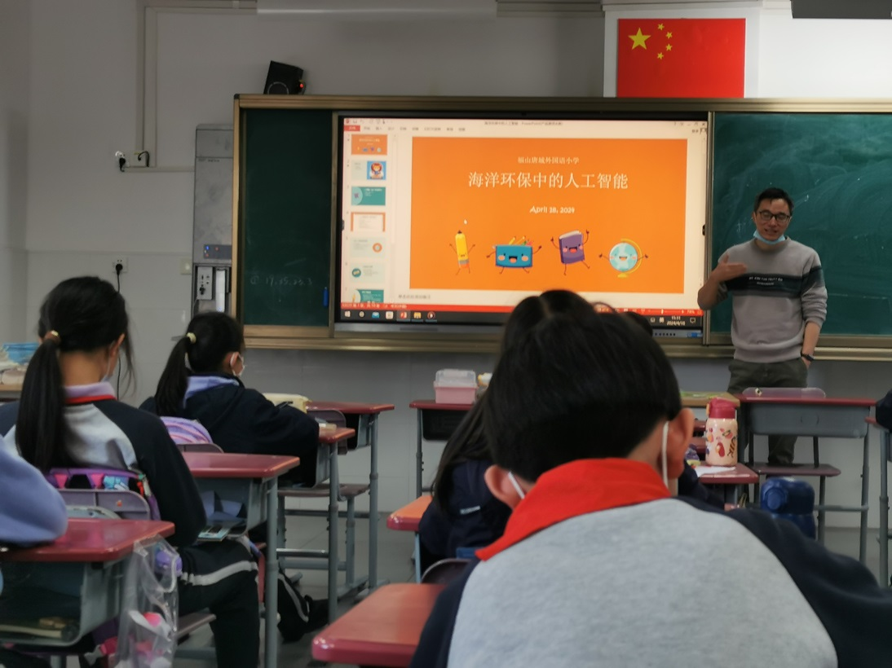
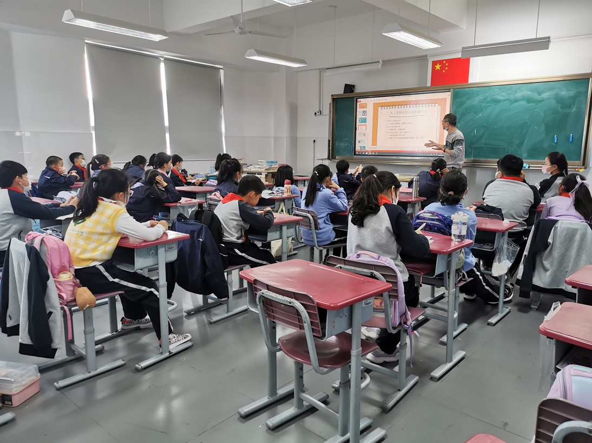

# Date 日期
April 18, 2024

2014年4月18日
# Activity 事件
I was invited to my son's school to participate in a parent classroom activity themed around technology and intangible cultural heritage. I chose the technology theme and delivered a lecture on "AI for Oceans" for the children.

我应邀在去我儿子的学校参加科技与非遗的家长课堂活动，我选择了科技主题，并给小朋友们做了AI for Oceans的演讲。
# Photos 照片

